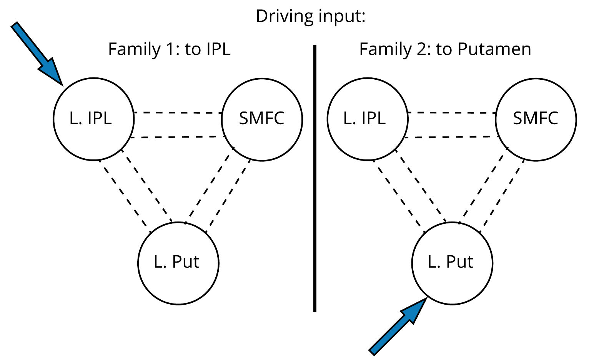
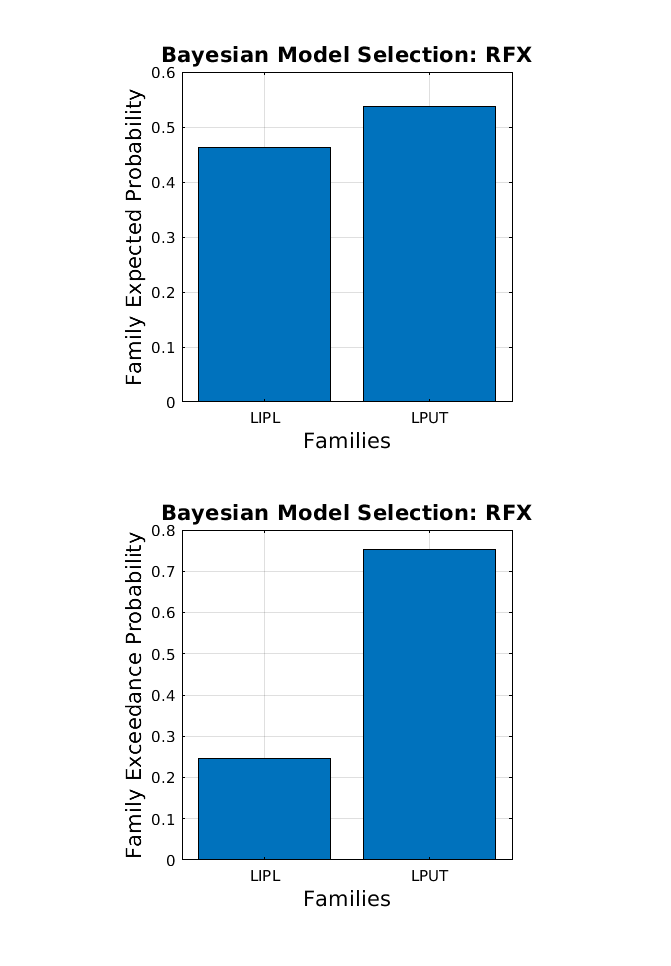
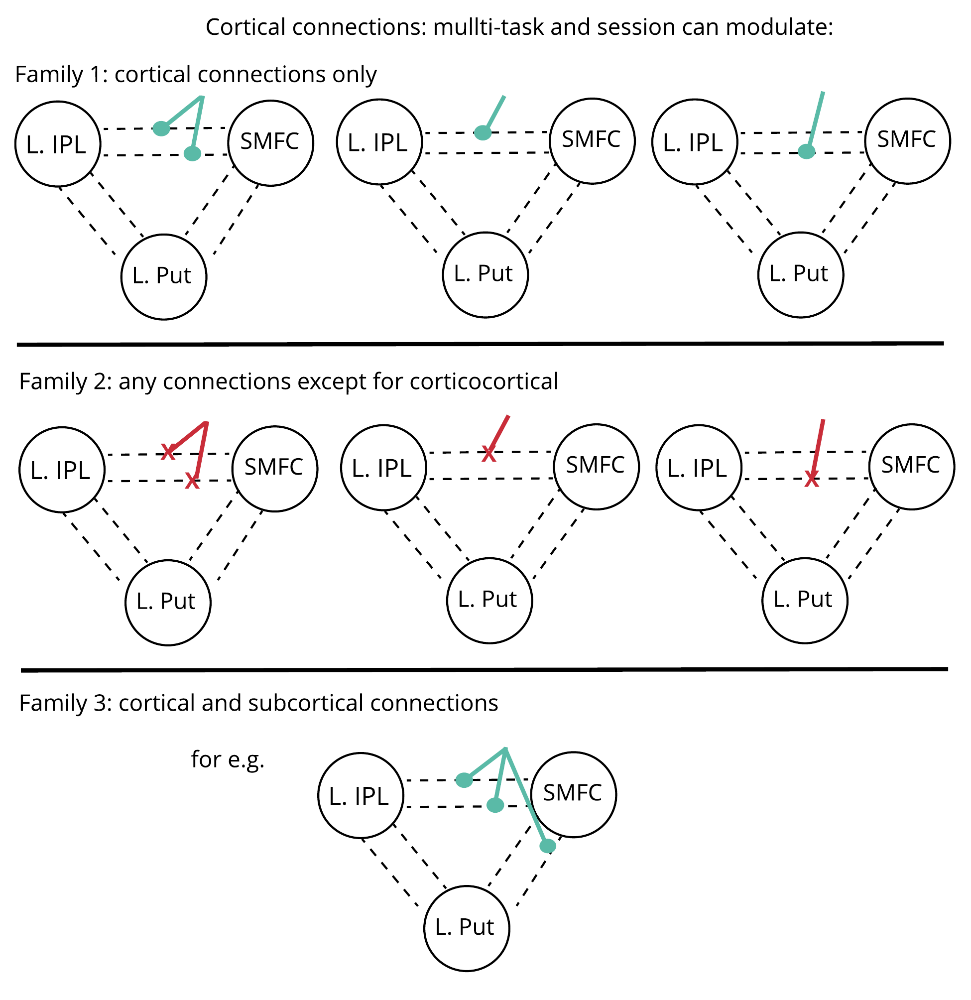
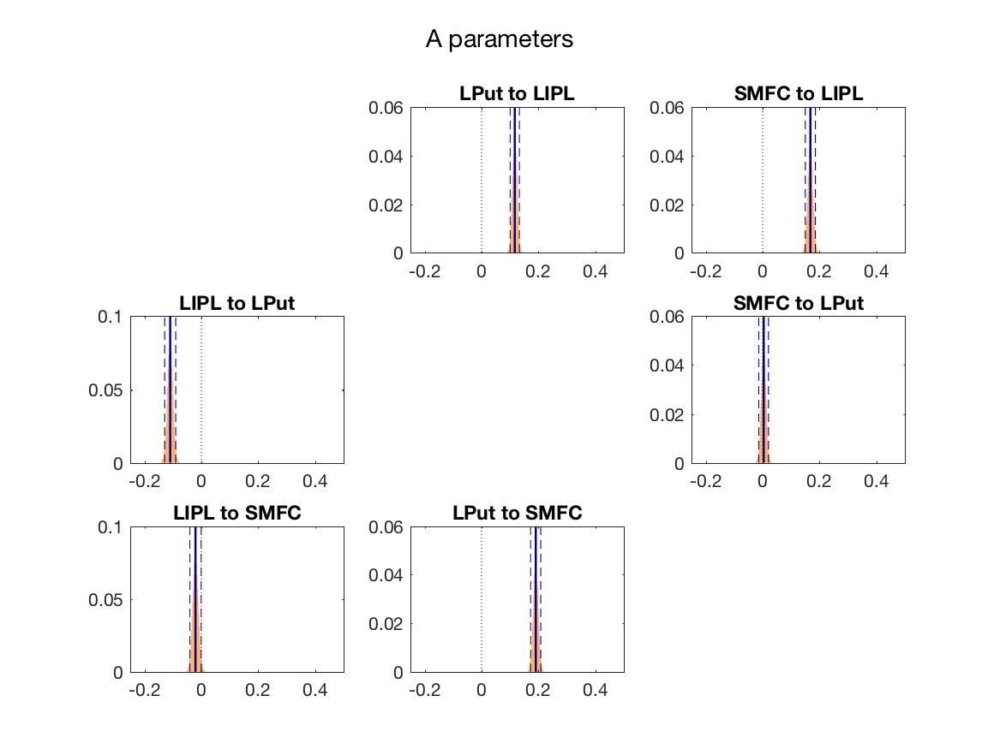
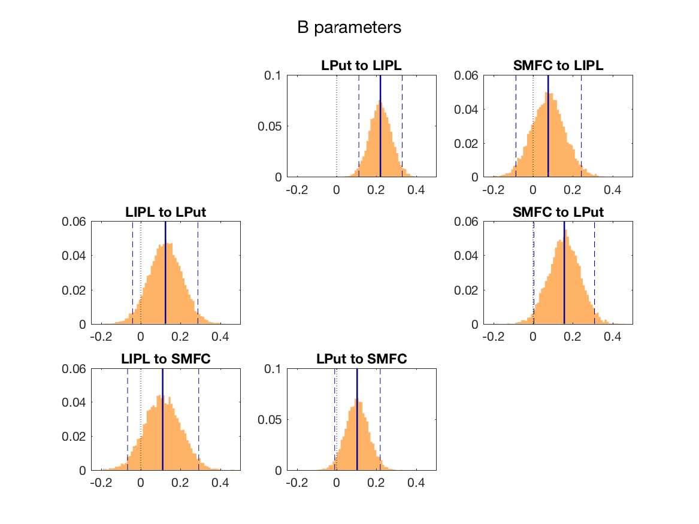
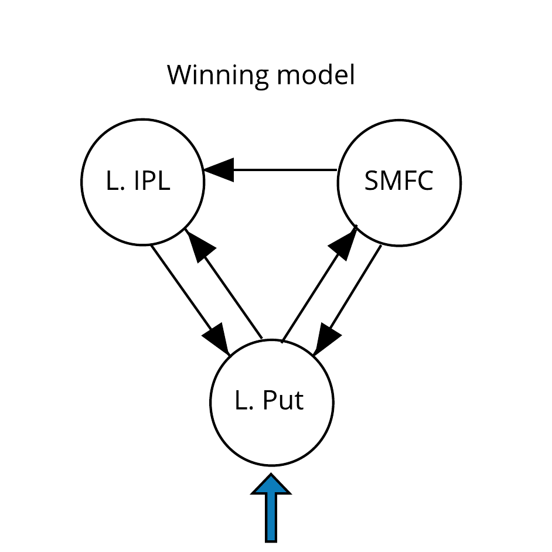
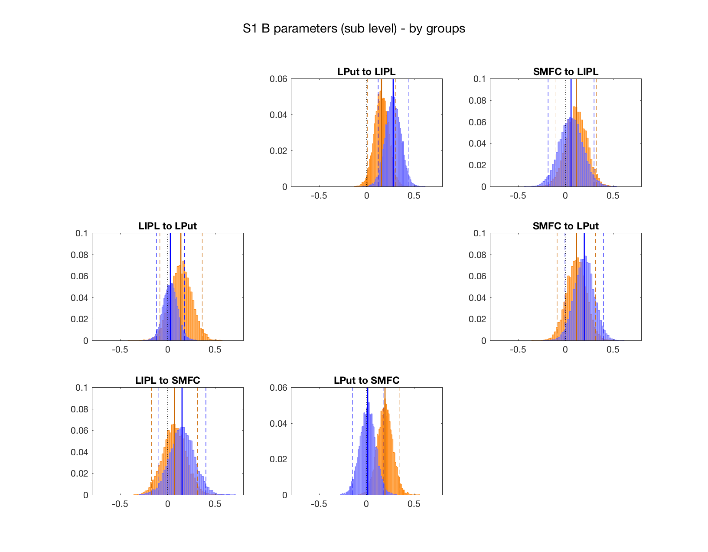

# s1_dcm_analysis_out

## summary:  
This folder contains the analysis script and outputs for the DCM model outputs generated by 
the analysis code in: *spm_dcm_sess1_anatROI_initGLM_run/*  

### Model overview
Proposing following state equation/matrix definitions:  

The A matrix assumes that all regions are endogenously coupled.  
The B matrix is an example for the modulatory influence of "multitasking". All possible 63 combinations of connections modulated by multitasking were fitted/compared.  
The C matrix is an example where driving input was assumed to occur via LIPL. Models that 
allowed driving input to LPut were also fitted/compared. 

### Q1. From which region do inputs drive the activity of the network?  
#### Figure 1: input family comparison:
  

#### Figure 2: Expected and exceedance probabilities for the model families w/ input to either LIPL or LPut

As can be seen, the network recieves driving inputs via the putamen.

### Q2. Does multitasking modulate cortico-cortical connectivity or striatal-cortical connectivity or both?     
#### Figure 3: cortico/striatal-connectivity family comparison
  
 Family 1 contains models where the B-parameters are only those depicted (i.e. a | b | c)
 Family 2 does not contain any models that allow cortico-cortical connectivity between LIPL and SMFC (i.e. a | b | c)
 Family 3 allows modulations to occur via cortico-cortical and striatal-cortical  
 
#### Figure 4: Expected and exceedance probabilities for the model families allowing a) only cortico-cortical modulations, b) only striatal-cortical modulations, or c) both
  

### Q3: Which corticocortical and striatal-cortical connections are modulated by multitasking demands?

Now that we now that multitasking modulates both cortiocortical and striatal-cortical connectivity, we perform Bayesian Model Averaging (BMA) to determine how confident we can be in the presence of each modulatory connection. To achieve this, we computed 95% confidence intervals for posterior distribution over each parameter (group-level estimate). Any connection that contained 0 within the 95% CIs was rejected. The remaining parameters are assumed to reflect reliable modulations of multitasking to that connection.

#### Figure 5: Estimated group-level posterior distributions over the a-parameters
 
Solid lines reflect the mean, whereas dashed lines reflect the 95% confidence intervals over the distribution. 

#### Figure 6: Estimated group-level posterior distributions over the b-parameters

As can be seen, we reject the presence of the LIPL -> SMFC connection. All others remain - giving the final following model for the modulatory influence of multitasking...

#### Figure 7: Connectivity model underpinning the modulatory influence of multitasking

### Control analysis: group baseline differences in the modulatory influence of multitasking?
To check that any subsequent observed differences regarding the modulatory influence of training (i.e. training vs. control group comparison from pre- to post-training) are not due to spurious baseline differences, we repeated the BMA analysis above for each group. The estimated posteriors over the b parameters are plotted by group below. As can be seen, the expected value for each group is within the 95% confidence intervals for the other group for each parameter except for the LPut -> SMFC connection. However, this difference does not survive if we adjust the confidence interval widtch to account for multiple comparisons (i.e. 99% CI/p=.01 - control group LPut -> SMFC 99% CI [-.097 .304], training group expected value = .287).

#### Figure 8: Posterior distributions over the b parameters (modulatory connections, plotted by group

### Q4: Do individual subject parameter estimates correlate with behaviour/multitasking costs?
See html file above for output of this analysis.