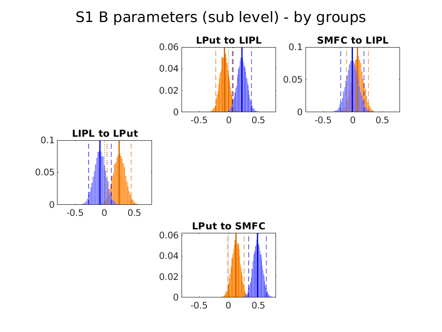
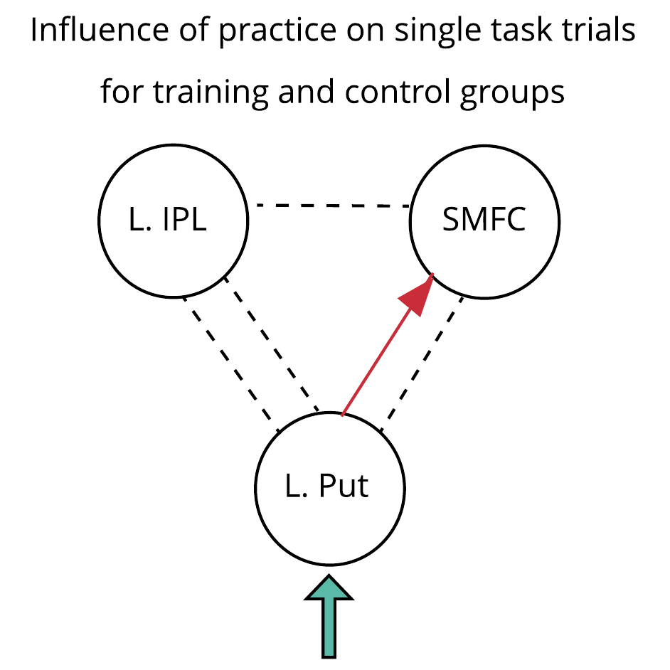

# s1_s2_multitask_and_practice_network_dcm_analysis

## summary:  
This folder contains the analysis script and outputs for the application of DCM to the fMRI/multitasking
dataset. Outputfiles/analysis generated by the code in: *spm_s1s2_dcm_anatROI_flGLM_winS1B_regOutMult/*

### Model overview
For the results of the first stage of the analysis see *s1_multitask_network_dcm_analysis_code/*
We next sought to identify the influence of practice on the multitasking network identified in the first analysis. We concatenated the pre- and post-training
data, and added a practice regressor to the GLM.

We assumed the presence of all possible endogenous connections, except that between LIPL -> SMFC (see Figure 7 in *s1_multitask_network_dcm_analysis_code/*)
The new DCM comprised one B matrices - to model the influence of practice on the previously established multitasking network on single task trials - we modelled all the various possible
combinations of modulation to the 5 connections (resulting in 31 possible models).
The network was assumed to be driven by inputs to the Putamen.

### Model inference plan
We performed BMS and BMA over the model space (n=31) seperately for the training and the control groups. As no single model emerged as strongly preferred in either group (albeit some group differences in preferred models), we conducted BMA across all models for each group, to determine which connections were reliably different from 0 (i.e. which connections we include in the final model for each group). We then identify group differences on parameters (by calculating the posterior probability that the group difference == 0). The estimated posteriors over parameters are plotted below:

#### Figure 1: Estimated posterior distributions over the b-parameters plotted by group
  
We only include the connection LPut -> SMFC for both groups, posterior probabilities show that the groups are also not different (p=.54).

#### Figure 2: Final model for the modulatory influence of practice on the network when single-tasks are performed, regardless of group
  

