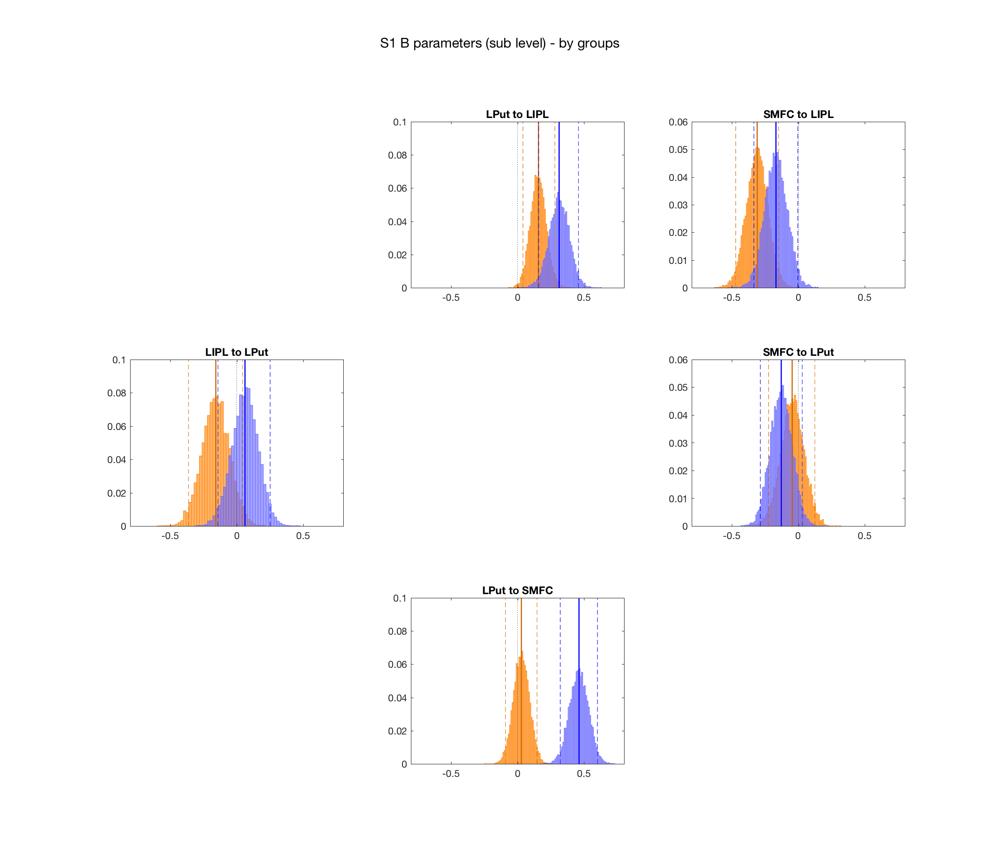
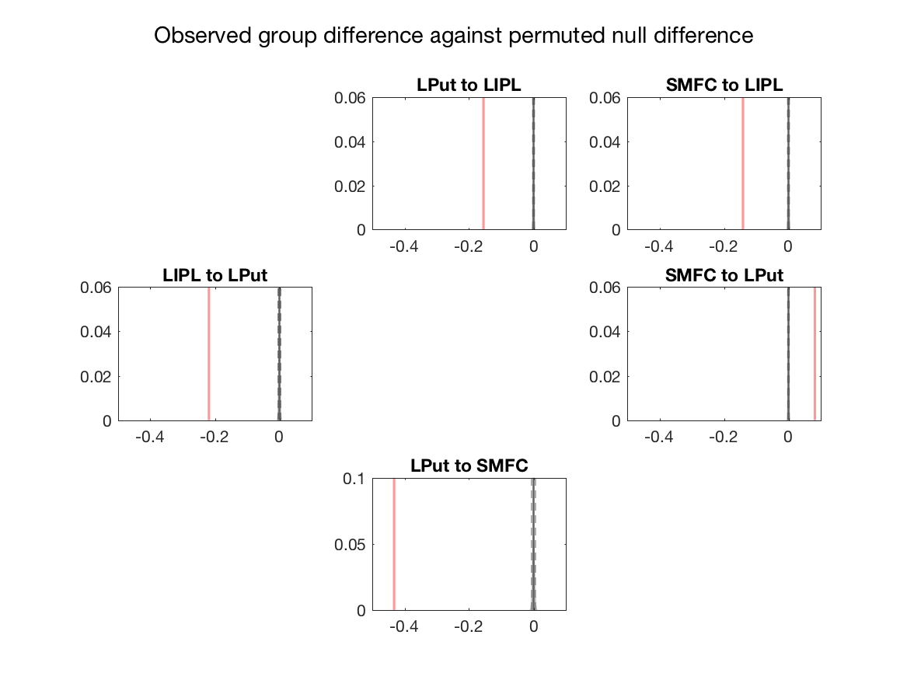

# s1_s2_multitask_and_practice_network_dcm_analysis

## summary:  
This folder contains the analysis script and outputs for the application of DCM to the fMRI/multitasking
dataset. Outputfiles/analysis generated by the code in: *spm_s1s2_dcm_anatROI_flGLM_winS1B/*

### Model overview
For the results of the first stage of the analysis see *s1_multitask_network_dcm_analysis_code/*
We next sought to identify the influence of practice on the multitasking network identified in the first analysis. We concatenated the pre- and post-training
data, and added a practice regressor to the GLM.

We assumed the presence of all possible endogenous connections, except that between LIPL -> SMFC (see Figure 7 in *s1_multitask_network_dcm_analysis_code/*)
The new DCM comprised two B matrices - The first described the previously established influence of multitasking.
We modelled the influence of practice with a second B matrix - we modelled all the various possible
combinations of modulation to the 5 connections (resulting in 31 possible models).
The network was assumed to be driven by inputs to the Putamen.

### Model inference plan
We performed BMS and BMA over the model space (n=31) seperately for the training and the control groups. As no single model emerged as strongly preferred in either group (albeit some group differences in preferred model), we conducted BMA over the parameters to estimate the fixed effect of practice for each group. The estimated posteriors over parameters are plotted by group below:
 
#### Figure 1: Estimated posterior distributions over the b-parameters plotted by group
  

As can be seen, we can be confident that the LIPL -> LPut parameter does not contain zero for either group, the SMFC -> LIPL connection is also (just) retained for both groups, and the LPut -> SMFC connection is retained for the control group but not the training group.

NOTE: Will redo this to add a fixed effects plot across both groups...

### Control analysis: Observed fixed-effect differences at the group level relative to a permuted null
In order to test whether these differences were statistically larger than is expected by chance, I compared the observed difference to a permuted null distribution (defined by pooling all observations, randomly selecting two groups and taking the mean difference over 10000 iterations). As can be seen from the figure below, all differences were larger than would be expected by chance.

#### Figure 9: Observed group differences relative to a permuted null

### Q4: Do individual subject parameter estimates correlate with behaviour/multitasking costs?
See html file above for output of this analysis.